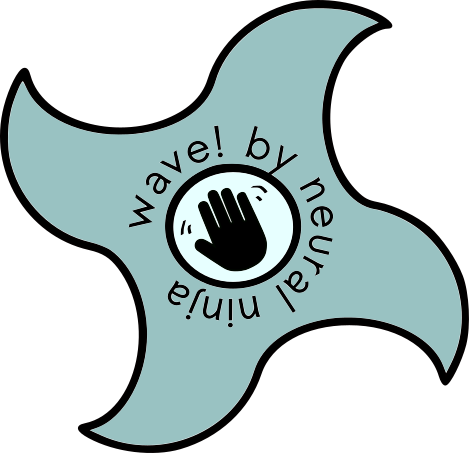
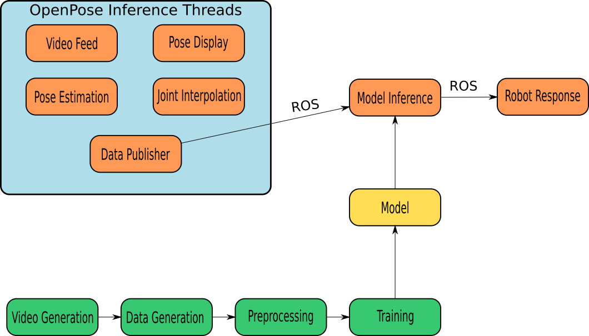
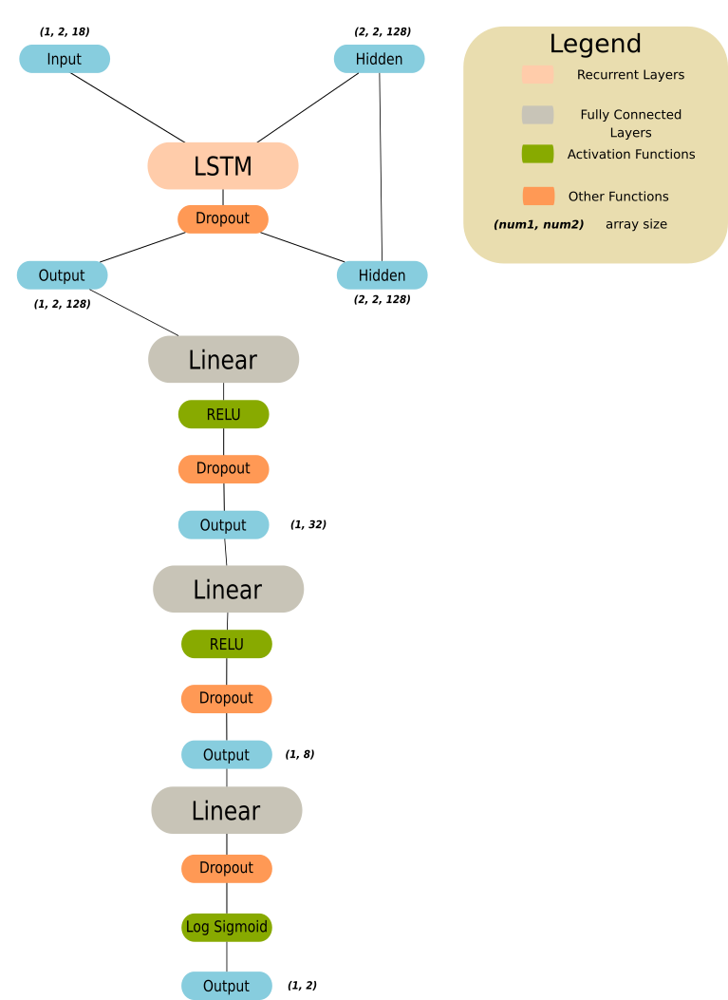
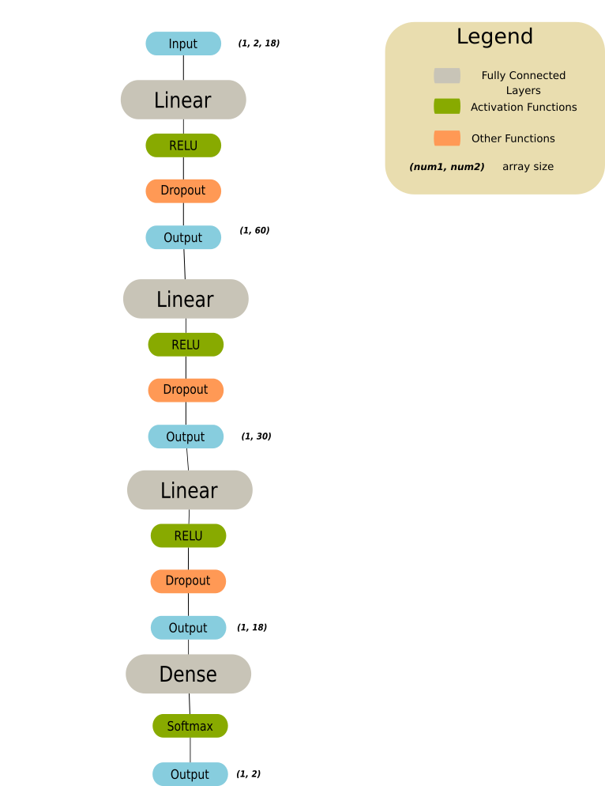
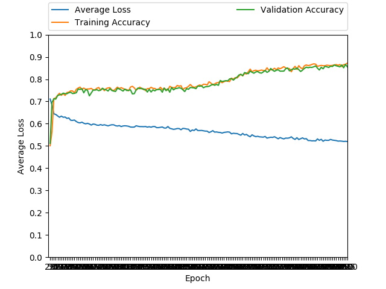

# Wave! by Neural Ninja

<p align="center">
  
</p>

Wave! is a gesture recognition neural network that uses [tf-pose-estimation](https://github.com/ildoonet/tf-pose-estimation), a tensorflow wrapper of a pose estimation neural network ([OpenPose](https://github.com/CMU-Perceptual-Computing-Lab/openpose "OpenPose")), to classify various hand gestures in images.

Wave! runs on top of OpenPose, which identifies various joints of humans in a given camera frame, such as their elbow or nose. In most cases, it returns the `x` and `y` positions of each bodypart in terms of percentage of the frame, a confidence score for each of these bodyparts, and a confidence score for each human it identifies. During [`Data Collection`](#Data-Collection), bodypart movement of the human with the highest confidence score is tracked and summed over a series of frames. This data, along with the confidence scores for each bodypart, is passed on to Wave! for classification. 

The most successful classification model at the moment is the Post OpenPose Neural Network (POPNN) in TensorFlow. This model is a fully connected feed forward binary classification model. It classifies images as either a "wave" or "no wave". 

We also worked on PyTorch LSTM and POPNN models that are more modular than POPNN in TensorFlow and support multiclass classification. We are adding this capability to the TensorFlow models as well.

## Application

This project was initially used with a humanoid robot to create an interactive user experience. Wave! does not require to be paired with a robot. In this interactive display, the robot waved if a human in its field of view waved at it. Data from each network, Wave! and tf-pose-estimation, was sent using Robot Operating System (ROS). Inference is done primarily on the Nvidia Jetson TX2, but can also be run on a PC if needed. Wave! can run on any robot that support ROS.

>**Note**: Wave! is only compatible with Python 2, due to ROS requirements and syntax.

## Setup

Unless specified, perform the following setup commands on your Jetson TX2 **and** PC (used for training).

Follow the instructions [here](https://github.com/dusty-nv/jetson-inference/#system-setup) to setup Ubuntu and flash additional software on your TX2.

Clone the Wave! repository:

    $ git clone --recursive https://github.com/NVIDIA-Jetson/Gesture-Recognition.git

Install program dependencies:
> This installs argparse, dill, matplotlib, psutil, requests, scikit-image, scipy, slidingwindow, tqdm, setuptools, Cython, pyTorch, and sklearn.

    $ sudo pip install -r requirements.txt

Install OpenCV:

    $ sudo apt-get install python-opencv

Clone the tf-pose-estimation repository:

    $ git clone --recursive https://github.com/ildoonet/tf-pose-estimation.git

Configure `tf-pose-estimation` for our purposes:
>This replaces `tf-openpose`'s `estimator.py` with a custom version for `Wave!`, and then installs `tf-openpose`.

```bash
$ cp -f wavenet/estimator.py tf-openpose/tf_pose/estimator.py
$ cd tf-openpose
$ python setup.py install
```

If you get an error along the lines of "can't find Arrow package" when installing tensorpack in the `setup.py install`, particularly when installing tf-pose on a Jetson our suggested fix is to delete the install of tensorpack (Take out any references to tensorpack or the github link for tensorpack in the `setup.py`) and then manually install tensorflow with TRT support on your Jetson with this [link](https://nvidia.app.box.com/v/TF170-Py27-wTRT "TRT"). After downloading the pip wheel, install it as follows:

    $ sudo pip install tensorflow-1.7.0-cp27-cp27mu-linux_aarch64.whl

Install [rospy](https://github.com/jetsonhacks/installROSTX2) on the Jetson TX2:
> Make sure you restart your terminal after setting up rospy (on both the Jetson TX2 and PC) before running anything with rospy to ensure everything runs smoothly.

```bash
$ git clone --recursive https://github.com/jetsonhacks/installROSTX2
$ cd installROSTX2
$ ./installROS.sh -p ros-kinetic-desktop-full
$ ./setupCatkinWorkspace.sh
```

Install [rospy](http://wiki.ros.org/kinetic/Installation/Ubuntu) on your PC by following the instructions [here](http://wiki.ros.org/kinetic/Installation/Ubuntu)

Install pyTorch [here]("https://pytorch.org/"), and follow the instructions on site to install the right version depending on your version of CUDA.

# Project Pipeline
<p align="center">
  
</p>

## Network Pipeline

Using `generate_video.py`, we generate videos of people performing the activities of different data classes ("waving", "X-Posing", etc.). These videos are given to `generate_data_from_video.py`, which runs inference on `tf-openpose` and extracts data for the networks. You can train a network by either running `lstm.py`, `popnn_torch.py`, or `popnn4.py`, with their corresponding arguments. Finally, you can run inference on this model by running either `lstm_multi_inference.sh`, `popnn_torch_inference.sh`, or `popnn_inference.sh`. These bash scripts run `thread_inf.py`, which creates multiple threads for collecting data for inference, and publishes them for inference, and either `lstm_inference.py` ,`popnn_torch_inference.py`, or `popnn4inference.py`, which run inference on the models.

## Multi-Threaded Inference

As mentioned in [`Project Pipeline`](#Project-Pipeline), `thread_inf.py`, the program that runs inference on `tf-openpose` to collect real-time data to feed to the network, is multi-threaded to increase the FPS of inference. The main thread starts 3 different threads which capture webcam frames, run pose estimation on these frames, and display the frame with pose estimation drawn on it. The main thread then publishes the pose estimation data on ROS for the main inference script. This functionality is also available on the TensorFlow Models.

# LSTM

The Wave! LSTM was made to take advantage of the sequential nature of camera feed data. One of the newer features of the PyTorch models (not in the TensorFlow models) is their adaptability and multiclass ability. Thanks to data collection and loading that can accomadate as many data features as needed (default: position, score, movement vector components). If you want to add your own data features or modify the PyTorch models or inference, check out the [`PyTorch Modification`](#PyTorch-Modification) portion of this README. The parameter centralization class, var, in [`var.py`](#var.py), allows for tinkering of model hyperparameters, such as number of classes, over all scripts that use them. As a result, it is easy to rapidly train and deploy Wave! PyTorch nets. At the moment, both of the PyTorch Models are not as accurate as POPNN (Post OpenPose Neural Network) in TensorFlow (by a small margin). As mentioned before, feel free to run, modify, or reference them.

## LSTM Network Architecture

The LSTM is comprised of a two layer, stacked LSTM, followed by 3 linear layers. After each of the linear layers is a dropout layer, during training, and an activation function, RELU after the first two layers, and a log sigmoid after the final layer to get the output between 0 and 1. 

<p align="center">
  
</p>

> **Note**: Due to the increased complexity of the model, the LSTM runs slower than both POPNNs. 

# POPNN

The Wave! Post OpenPose Neural Network (POPNN) is the original, and most accurate model (the TensorFlow version). At the moment, it is currently integrated with the `var` class, but does not allow for multiclass classification or more than one feature. The model itself trains much faster than the LSTM, with 1200 epochs finishing in around five minutes. As mentioned before, feel free to run, modify, or reference this code, and contribute back if you would like.

## POPNN Network Architecture

Just like the TensorFlow version, the PyTorch POPNN consists of 4 linear layers. After the first three of these layers is a dropout layer and a RELU, and the final linear layer has a softmax after it to squeeze the output between 0 and 1. It also has dropout layers during training to prevent overfitting.

<p align="center">
  
</p>

## Var.py

`var.py` is the parameter hub of the repository. It contains the hyperparameters of the models and other often referenced by many other scripts, such as the classification classes and number of data features. `var.py` offers control over the more nitpicky hyperparameters of the models that their argparse flags do not, like hidden layer sizes, while allowing you to do so in only one place. Because so many file reference `var.py`, it is imperative that any modifications made be reflected in `var.py` (This mainly applies to data collection programs). For example, if you add a new feature to data collection that you want to train on, you must change the `features` variable in `var.py` accordingly.

### Usage

`var.py` is a class that when initialized in a program, contains data relating to many different paraments.

To import and create an instance of the `var` class (if you need to):

    from var import var
    v = var(use_arm)

`use_arm` in this case is a boolean which if `True`, means that only 8 joints (out of 18 total) are being used to collect data on or train on (arm joints, nose).

 `Var` comes with several helpful methods to extract parameters from itself.

    input_size = v.get_size(): # Get the input size of data/Number of joints being saved
    lstm_vars  = v.get_LSTM(): # Get full list of LSTM variables'''
    popnn_vars  = v.get_POPNN() # Get full list of POPNN variables
    classes  = v.get_classes() # Get classification classes
    num_features  = v.get_num_features(): '''Get number of features of data collection. For example, using x position, y position, and score would be 3 features.'''
    num_classes = v.get_num_classes(): # Get number of classes

## Data Collection
Wave! uses the difference in position of joints, as well as their confidence scores, to classify an image. During data collection, Wave! runs inference on OpenPose, and saves the positions of bodyparts from each iteration. The differences between bodypart positions over 4 (this number can be changed in the data collection phase) consecutive frames is summed and saved as an `.npz`, along with the averages of bodypart scores over the same frames. Every datapoint is saved in terms of percentage of frame in the `GestureData` directory.

Our data collection process consists of two steps : video generation, and data generation. Because the videos are generated and saved separately, you can reuse videos to extract different features from them with different argparse flags as shown below.

### Collecting Data via Video 
> Collects Data and stores it in the `.avi` format. Data can be used to create data for Wave!

To collect video data, run `generate_video.py`:

    $ python generateVideo.py # --camera=<port number> --time=<recording seconds> --dir=<datafile>
    # Uncomment the flags above to either manually set camera number (default=1), change video length or change save directory

When prompted, type in the data class ("wave", "no wave", etc.) that you want to collect data for.

To generate training data from these videos, run `generate_data_from_video.py`:

    $ python generateDataFromVideo.py #--exit_fps=<fps> -f=<numFrames> -a -o -s=<startVideoNum> -e=<endVideoNum> 

Uncomment  `exit_fps` to set the desired fPS of the data collected (inference on Jetson can be slower than inference on a PC). The default is `5`. Uncomment `-f` to set the the number of frames that movement is aggregated over. The default is `4`. Add the `-a` flag to collect data on net distance and angles (vectors) instead of change in `x` and `y`. When running this file, the default data that is generated is for every keypoint on every person's body. However, when recognizing waves, the network only cares about the shoulders, elbows, wrists, and nose. So, to only generate data for these seven keypoints, add the `-o` flag. By default, `generate_data_from_video.py` generates data from all files in your data directory. To only generate data from a couple of videos in the data directory, specify a video number to start with using the `-s` flag and a video number to end on with the `-e` flag.

### Smart Labeler

Just like POPNN, there is a smart labeler, which can detect edge cases that fail and create valid data that you can transfer learn off of. 

To collect data with the smart labeler, run this command:

    $ bash smartLabeler.sh # --camera=<port number> --debug --wave
    # Uncomment the flags above to either manually set camera number (default=1) or say that the user is waving (no wave without flag).
    # If using all flags, write in the above order

If you are generating videos on multiple computers and are compiling all video data on git, you may need to rename your label and data files to avoid merge conflicts or overwritten data. For your convenience, we have created `renamer.py`, which you can use to change the numbering of files in the `data/video/videos` and `data/video/labels` folders. So, you will be able to merge data from different machines seamlessly. To rename the video files, run `renamer.py`:

    $ python renamer.py -b=<buffer>

 The `-b` flag should be an integer by which the program increments the filenames.

## Training

Before training, ensure all your data is in the appropriate folders.

The best results are usually obtained when the amount of "no wave" data is close the amount of "wave" data. To check how much of each type of data you have accumulated, run `data_count.py` as follows:

    $ python data_count.py -f=<numFrames> 

Set the `-f` flag to the number of frames specified when creating data from videos.

## LSTM

Run `lstm.py` in order to start training the LSTM (run popnn.py with the same arguments to train a POPNN model). You can adjust the learning rate, hidden layer size, and more to experiment with different net structures.

    $ python lstm.py # -s=<save_fn> -t -c=<ckpt_fn> -lr=<learning_rate> -d=<learning_rate_decay> -e=<numEpochs> -f=<numFrames> -b=<batch_size> -o

To keep more than one checkpoint file, specify a filename to save the generated checkpoint file to save to. The default is `lstm000.ckpt`, and is saved in the `lstmpts` directory. If left unchanged, newly generated checkpoint files will overwrite one another. Checkpoint files are given the `.ckpt` filename extension in this project. The LSTM gives you control over the network's finer details, including learning rate, number of epochs, epoch batch size, and the rate of decay of the learning rate (if not specified, learning rate will stay constant).

If you would like to transfer learn from one model to the next, uncomment `-t` in the command above. Specify a checkpoint filename after the `-c` flag to transfer learn from. The default is `lstm307.ckpt`, our best performing model. Also, if you only want to train on the data from the arm keypoints, uncomment the `-o` flag.

To save a model while it's training, press `Ctrl + C`.

## POPNN (TensorFlow)
Before training, ensure all your data is in the appropriate folders.

To train the network, run `popnn4.py`:

    $ python popnn4.py --dest_ckpt_name=<saveFileName> # -t -f=<numFrames> --debug --bad_data

The `--dest_ckpt_name` or `-d` flag is required, and should be set the the filename the generated checkpoint file will be saved to. Checkpoint files are given the `.ckpt` filename extension in this project.

The program will print the loss after every epoch, as well as the training accuracy and validation accuracy. 

For transfer learning, add the commented out `-t` tag, and the program will prompt you for a file to transfer learn off of. This loads the previously trained weights from the pretrained checkpoint file, and trains with them. 

Uncomment the `--debug` flag for some helpful print statements for debugging purposes. Finally, uncomment the `--bad_data` or `-bd` flag to only use data in which humans in frame are not flickering in and out of frame. 

Note: POPNN is tensorboard compatible. We have currently implemented some basic tensorboard summaries so you can visualize your graphs as specified in the [TensorBoard API](https://www.tensorflow.org/guide/summaries_and_tensorboard).

## POPNN (PyTorch)

## Graphs

After training a model, a graph of the checkpoint file will be generated (for PyTorch models), showing the loss, training accuracy, and validation accuracy for every 25 epochs. This can help you visualize how good your model is. Below, you can see an example of a generated graph from model 307.


## Inference

### LSTM
To run inference on the LSTM, run the `lstm_multi_inference.sh` with the following command:

    $ bash lstmMultiInference.sh  # <port number> <numFrames>-c=<checkpoint file number> -o -a

Like the other inferences, uncomment the flags to specify a camera port number, or debug the code. Keep the flags in the same order. Even if you are not using them all, you must type out all flags before the ones you want to use (i.e if you want to specify a checkpoint file, you must specify a camera port number and the number of frames to aggregate over). Change the `-c` flag to the name of the new checkpoint file you would like to run inference on. If you only want to run inference on the seven keypoints necessary to recognize a wave, simply uncomment the `-o` flag.

### POPNN (TensorFlow)
Wave! can run inference on multiple people in a frame. To run inference, run the following command:
    
    $ bash popnn_inference.sh

`popnn_inference.sh` launches the roscore, runs inference on Wave!, and sends data through ROS publishers. However, the data collection process in `popnn_inference.sh` is modified to return data of every human `tf-pose-estimation` detects in each frame. If the number of humans changes, the data collector looks at a new batch of 4 images, because we do not know who left or entered the image. To specify which camera port is being used, add the `--camera=<port number>` flag. To debug, add the `--debug` flag after the `--camera` flag.


### POPNN (PyTorch)

## Graphs

After training a model, a graph of the checkpoint file will be generated (for PyTorch models), showing the loss, training accuracy, and validation accuracy for every 25 epochs. This can help you visualize how good your model is. Below, you can see an example of a generated graph from model 307.

<p align="center">
  
</p>

# Other Notes

For all the networks we have made, there have been a few naming conventions we have used within our program, some root files we have modified, and other short things to note for the user.

## PyTorch Modification
As mentioned earlier, the PyTorch models, data collection methods, and inference code was made to make modification as easy as possible. A lot of this is thanks to the `var` class, which allows for all programs to refer to a single list of important parameters. 

### Data Collection

The primary data creation program is `generate_data_from_video.py`, which extracts certain data features, such as x and y position, score, and distance traveled. If you want to extract other features, or extract less features, modify the code loop to accumulate data in a numpy array, and add it to the list, `features` in the following line.

        features = [xDifferences, yDifferences]

By default, the `scoreAvgs` variable is added to the end of features to allow for the mulitiplication of score and other features. Additionally, change the `num_features` variable in `var.py` to reflect the number of features you are using. After training the network, you must modify the `post_n_pub` method in the `PosePub` class to collect the same data during inference and publish it, as shown [`here`](http://wiki.ros.org/rospy/Overview/Publishers%20and%20Subscribers). You can also follow the usage of publishers in our code. In order to do so, you must : create a rospy publisher, accumuluate data in a numpy array, and publish the data (most likely as a string). 

To collect data for different classes, add them to the `classes` dictionary in `var.py` in the following format.

    classes = {previous classes, number : "class name"}

When generating video using `generate_video.py`, you will be prompted for what data class you are recording data for.

### Inference

If you add more features in the data collection phase, train the network on these features, and send these features through `post_n_pub`, you must change the inference scripts, `lstm_inference.py` and `popnn_torch_inference.py` to accomadate the new data. First, you must create a rospy subscriber to listen to the features from `post_n_pub`, as shown [`here`](http://wiki.ros.org/rospy/Overview/Publishers%20and%20Subscribers). You can also follow the usage of subscribers in our code.

## Data Collection Naming Conventions

To avoid confusion between the two POPNN models, the popnn models in PyTorch, as well as their accompanying files, have `_torch` in their name.
For all video data collected we use the form `#.avi`, where `#` is the number of the latest file stored. Thus, we encourage you to keeping using that so that `generate_data_from_video.py` does not incure bugs.

For all processed data in npz format, we use the format `gestureData#.npz`, where `#` is the number of the latest file stored. Again, for the sake of bugs, we encourage you to keep using that in the event you inject your own custom npz files. The standard `dataloader.py` should take care of this kind of data well.

All labels are in the format `#.txt`, similar to the video data, for the same reasons. 

## Transfer Learning and Model Saving Conventions

After training a model, they will save a checkpoint file which stores the previous weights of the model and can be used to inference on the previous model and to transfer learn for new models. 

The naming convention for our checkpoint files is in the format `fooxyz.ckpt`, where foo is the name of the network type, either lstm or popnn depending on your network, x is for the network architecture (e.g. currently 4 for the best stable version of popnn), y is for the type of data collected (e.g. currently 3 for our 3rd major data change in version 4) and can also represent image frames per data instance (e.g. 7 for 7 frames per data instance and 10 for 10 frames per data instance), and z is for the latest training iteration. `.ckpt` is the suffix used fo rthe checkpoint files.

Some of our most stable popnn versions include `4.2.7`, `4.3.4`, and `4.3.11`. There tend to be gaps between many versions due to many bad training iterations, and/or versions we felt were inferior to the other versions. The most stable lstm version is `3.0.7`.

## General File and Code Naming Conventions

When naming python files, we use underscores to separate words, rather than using camel case. This helps with file readibilty. 

When adding detailed comments to the code, the comments are in the format `''' comment '''`, instead of using the format `#comment`.

## Modifications to TF-Pose

If the `tf_pose` library has been giving you issues, make sure you refer to our setup portion up above. `tf_pose` is fantastic for tensorflow pose-estimation (the alternatives are written in the less general user-friendly caffe) and thus can be easily ported to other tensorflow networks or models.

If you are modifying code in TF-Pose, you may need to see which numbers correspond to which joints in `numJoints[]`. Here is a list of numbers and their corresponding joints:

| Joint Number | Joint Name     |
|--------------|----------------|
| 0            | Nose           |
| 1            | Neck           |
| 2            | Right Shoulder |
| 3            | Right Elbow    |
| 4            | Right Wrist    |
| 5            | Left Shoulder  |
| 6            | Left Elbow     |
| 7            | Left Wrist     |
| 8            | Right Hip      |
| 9            | Right Knee     |
| 10           | Right Ankle    |
| 11           | Left Hip       |
| 12           | Left Knee      |
| 13           | Left Ankle     |
| 14           | Right Eye      |
| 15           | Left Eye       |
| 16           | Right Ear      |
| 17           | Left Ear       |

### GPU Configuration

`tf_pose` takes up a lot of compute, and sometimes can eat of your memory if you're not careful with limiting how much memory it can take per operation. If you are getting GPU sync errors or fatal errors (NOT warnings) to do with RAM or GPU RAM allocation, you can limit the memory used by `tf_pose` per process for inference in the wave_inference file as follows: 
    
    Line 93: s_tf_config = tf.ConfigProto(gpu_options=tf.GPUOptions(per_process_gpu_memory_fraction=n))

Where n is any fraction between `0` and `1`, set to `0.2` by default. Reduce this if you run into RAM allocation problems

## X-Pose, Y-Pose, and Dab Recognition

In addition to detecting "waves" and "no waves," we have built in recognition for other gestures - x-poses, y-poses, and dabs. To make an x-pose, cross your arms in front of your body to make an "x" shape. To make a y-pose, put your arms above your head in a "y" shape. In order to recognize these poses, we took two different approaches-one where we hard coded recognition, and another where we trained a neural network to recognize the poses. 

### Hard Coded Recognition

When running `lstm_wave_inference`, we print whether someone in the frame is doing one of these gestures.

### Neural Net Recognition

## Bad Data Nuances

When looking through our code you may see numerous references to 'bad data', and as could probably be inferred, bad data refers to data mistakes that TF_Pose produces when doing the preprocessing for our network. While, of course, not all data mistakes can be accounted for, there are a few big ones we can account for, that do in fact affect our dataset and our inference.

### Up and Down Arms

The first major data deficiency we need to account for is that when arms are down in a frame, we multiple the joint scores by -1 as a preprocess to our network. However, when lifting that arm to the point where its positive, this results in a large perceived shift in distance by our network, even when there is none. In fact, if you look through our code in `thread_inf.py`, you will see that we've accounted for this by labeling changes from positive to negative arm position and vice versa so that the network doesn't receive that bad data (we send a null array instead using pub_null()). This is something we have not left as an option for the user to change simply with a flag because it is a very big deficiency. If you are indeed curious, however, please do check it out in the code!

### Flashing Arms

This deficiency, while minor, occurs when TF_Pose can't properly identify arms from frame to frame, so the arms are sometimes there and sometiems nonexistent. As a result, we've added a flag which can be toggled to judge whether or not the inference should account for that and send a null array when it happens. The upside of enabling the flag is that you will have less messy data, but the downside is that your inference can take a bit longer if the person isn't sitting right in the frame for a while, and the network sensitivity can decrease as well.

## License

MIT, see [`LICENSE`](LICENSE.md)

## Authors

Wave! was made Maddie Waldie, Nikhil Suresh, Jackson Moffet, and Abhinav Ayalur, four NVIDIA High School Interns, during the summer of 2018.
